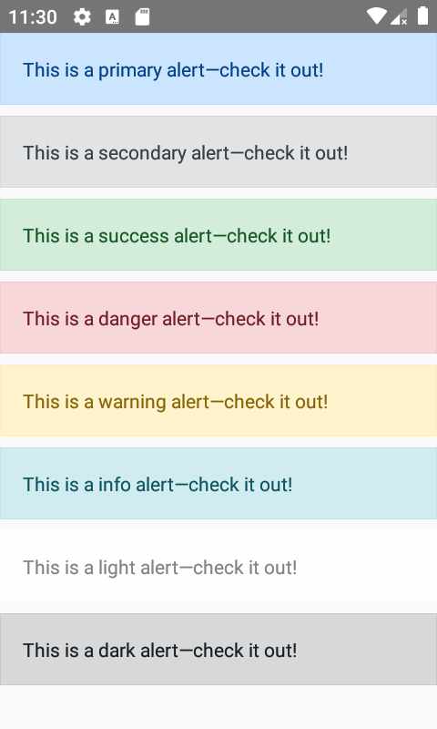
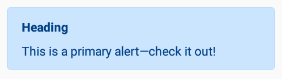
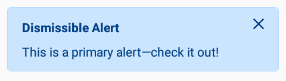

<p align="center">
  <a href="#">
    
  </a>
</p>

<p align="center">
  Cross Platform <a href="https://getbootstrap.com/">Bootstrap</a> components built for <a href="https://facebook.github.io/react-native/">React Native</a>
</p>


## React Native Bootstrap

The idea behind is similar to [`react-bootstrap`](https://github.com/react-bootstrap/react-bootstrap), to write Bootstrap component for React Native. The project is still in early phases, contributions are welcome.

## 📦 Table of Content

- [Getting Started](#getting-started)
- [Components](#components)
- [Demo App](#demo-app)

## <a name="getting-started"></a>🚀 Getting Started

1. Type below command to get install package from github

    ```bash
    yarn add react-native-bootstrap
    # or with npm
    npm install react-native-bootstrap
    ```

## <a name="components"></a>✨ Components

<details><summary>Alert</summary>

Provide contextual feedback messages for typical user actions with the handful of available and flexible alert messages.

### Examples

Alerts are available for any length of text, as well as an optional dismiss button. For proper styling, use one of the eight `variant`s.




```jsx
import { Alert } from 'react-native-bootstrap';
```

```jsx
[
  'primary',
  'secondary',
  'success',
  'danger',
  'warning',
  'info',
  'light',
  'dark',
].map(variant => (
  <Alert
    variant={variant}
    containerStyle={{ marginBottom: 8 }}
    messageStyle={{ fontSize: 16 }}
    message={`This is a ${variant} alert—check it out!`}
  />
))
```

### Heading

Alerts can also contain heading.



```jsx
<Alert
  title="Heading"
  message="This is a primary alert—check it out!"
/>
```

### Dismissing

Add the `dismissible` prop to add a functioning dismiss button to the Alert.



```jsx
const [alert, showAlert] = useState(true);

return (
  {alert ? (
    <Alert
      dismissible
      title="Dismissible Alert"
      containerStyle={{ marginBottom: 8 }}
      onClose={() => showAlert(false)}
      message="This is a primary alert—check it out!"
    />
  ) : (
    <Button title="Show Alert" onPress={() => showAlert(true)} />
  )}
)
```

### Props

| Prop | Type | Description | Required | Default |
|---|---|---|---|---|
| variant | `primary` \|<br/> `secondary` \|<br/>  `success` \|<br/>  `danger` \|<br/>  `warning` \|<br/>  `info` \|<br/>  `light` \|<br/>  `dark` | The Alert visual variant | ❌ | `primary` |
| message | string | Message to be displayed in Alert | ✔️ | - |
| title | string | Title to be displayed in Alert | ❌ | - |
| dismissible | boolean | Renders a properly aligned dismiss button, as well as adding extra horizontal padding to the Alert | ❌ | false |
| onClose | function | Callback fired when alert is closed | ❌ | - |
| containerStyle | [View style (object)](https://reactnative.dev/docs/view-style-props) | Style for the container which host the text message | ❌ | {} |
| messageStyle | [Text style (object)](https://reactnative.dev/docs/text-style-props) | Text style for message | ❌ | {} |
| titleStyle | [Text style (object)](https://reactnative.dev/docs/text-style-props) | Text style for title | ❌ | {} |

</details>

## <a name="demo-app"></a>📱 Demo App

Checkout the official [React Native Bootstrap App](https://github.com/react-native-bootstrap/react-native-bootstrap-app) which uses all of the React Native Bootstrap components.

## Author

Sanjeev Yadav

[](https://twitter.com/alexakasanjeev)

[](https://github.com/alexakasanjeev)

## 🛡 License

This project is licensed under the GNU v3 Public License License - see the [LICENSE.md](LICENSE.md) file for details.
